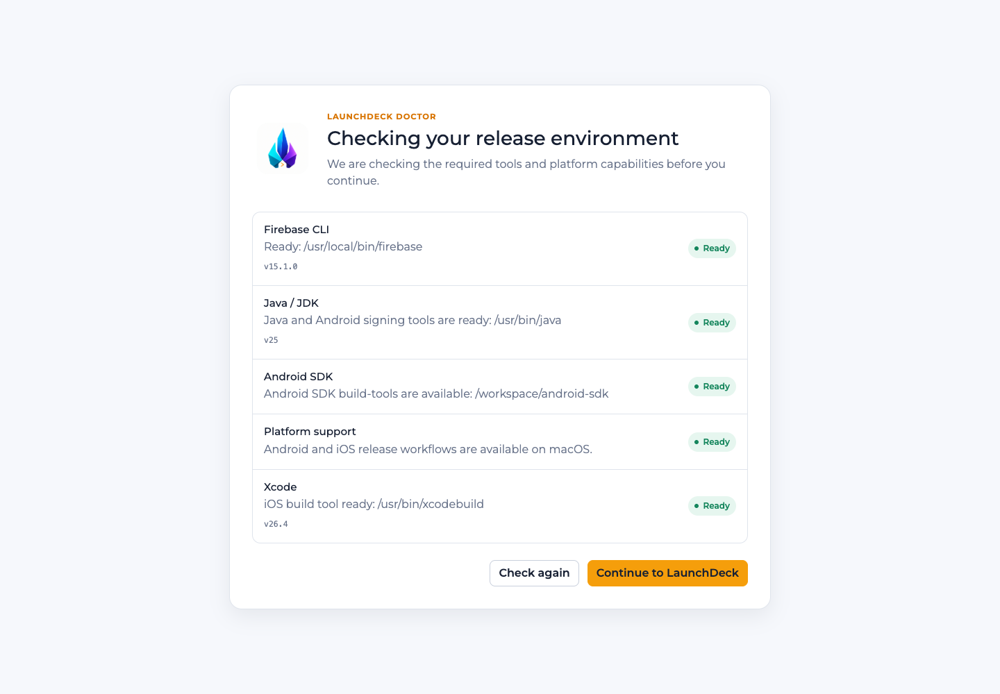
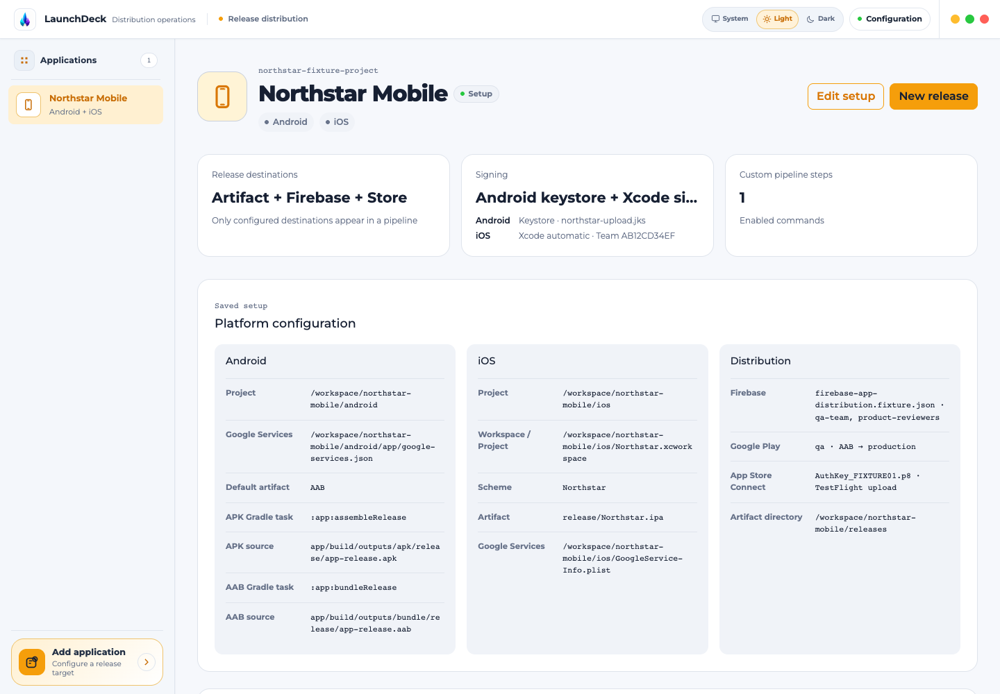
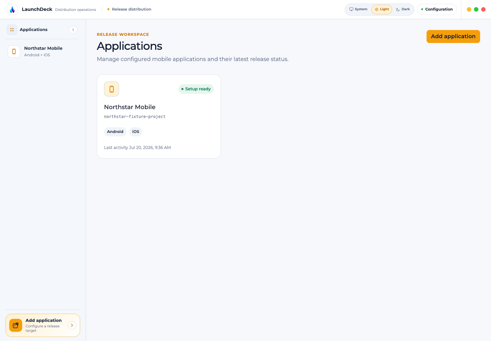
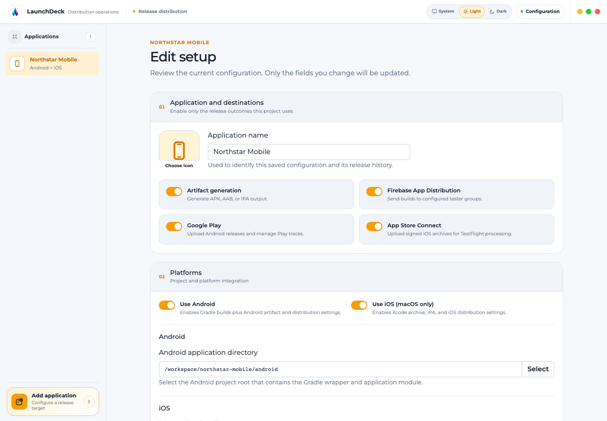
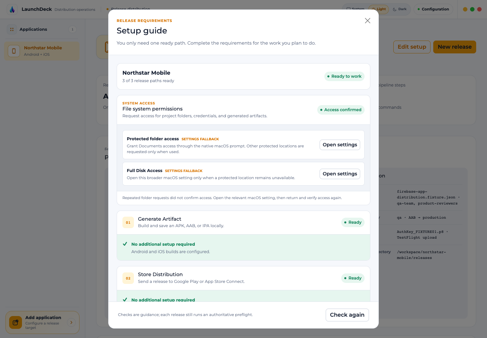
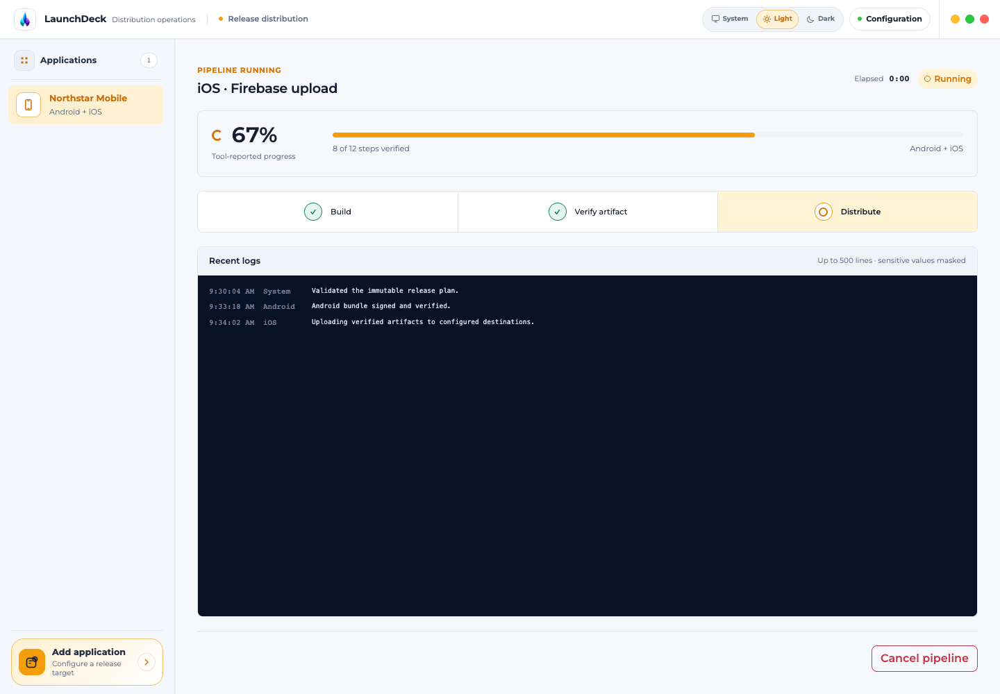
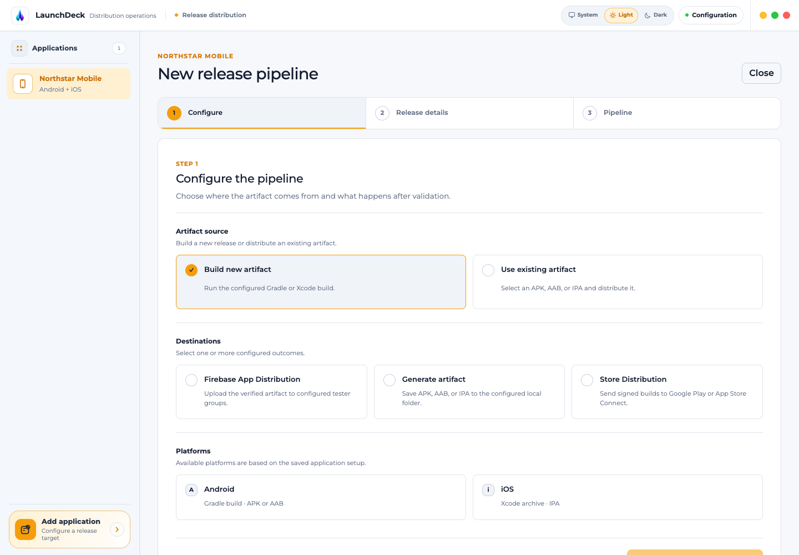
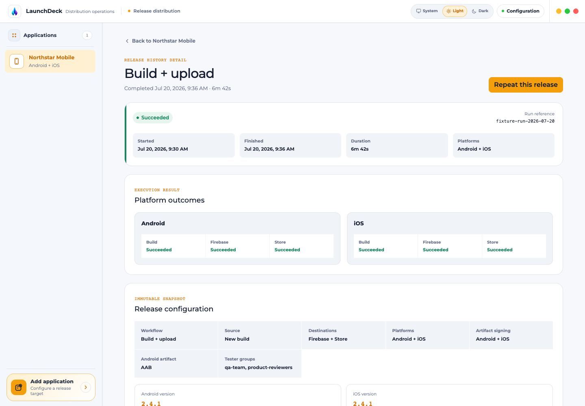
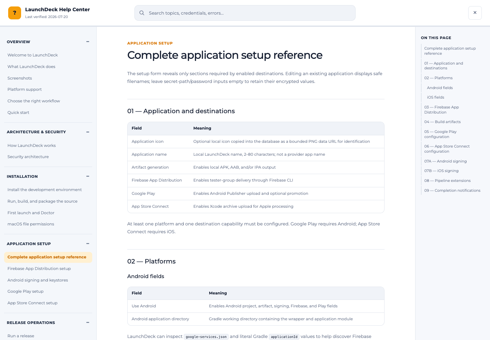
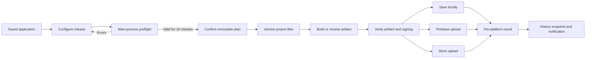

# LaunchDeck

LaunchDeck is a security-focused Electron desktop application for building, signing, verifying, saving, and distributing Android and iOS releases. It coordinates local artifact generation, Firebase App Distribution, Google Play, and App Store Connect from one observable release pipeline.

> **Last verified: 2026-07-20.** Provider consoles, role names, permissions, upload requirements, and navigation paths can change. Follow the linked official documentation if a screen no longer matches this guide.

The product language is English (US). The canonical source repository is [https://www.github.com/cangokceaslan/LaunchDeck](https://www.github.com/cangokceaslan/LaunchDeck). LaunchDeck is distributed under the [MIT License](https://www.github.com/cangokceaslan/LaunchDeck/blob/main/LICENSE).

## Table of contents

- [What LaunchDeck does](#what-launchdeck-does)
- [Screenshots](#screenshots)
- [In-app documentation](#in-app-documentation)
- [Platform support](#platform-support)
- [Choose the right workflow](#choose-the-right-workflow)
- [Quick start](#quick-start)
- [How LaunchDeck works](#how-launchdeck-works)
- [Security architecture](#security-architecture)
- [Install the development environment](#install-the-development-environment)
- [Run, build, and package the source](#run-build-and-package-the-source)
- [First launch and Doctor](#first-launch-and-doctor)
- [macOS file permissions](#macos-file-permissions)
- [Complete application setup reference](#complete-application-setup-reference)
- [Firebase App Distribution setup](#firebase-app-distribution-setup)
- [Android signing and keystores](#android-signing-and-keystores)
- [Google Play setup](#google-play-setup)
- [App Store Connect setup](#app-store-connect-setup)
- [Run a release](#run-a-release)
- [Release results, history, and fast actions](#release-results-history-and-fast-actions)
- [Custom pipeline steps](#custom-pipeline-steps)
- [Data storage and backups](#data-storage-and-backups)
- [Credential rotation and revocation](#credential-rotation-and-revocation)
- [Troubleshooting](#troubleshooting)
- [Security checklist](#security-checklist)
- [Known limitations](#known-limitations)
- [Screenshot renderer](#screenshot-renderer)
- [Project structure](#project-structure)
- [Glossary](#glossary)
- [Official resource index](#official-resource-index)

## What LaunchDeck does

LaunchDeck turns several sensitive command-line and provider-console procedures into a typed, preflighted desktop workflow. A saved application can support any valid combination of:

- Local APK, AAB, or IPA generation.
- Firebase App Distribution to one or more tester-group aliases.
- Google Play upload to the internal testing track and optional promotion to another track.
- App Store Connect upload for Apple processing and later TestFlight or App Store use.
- Android signing through a JKS/keystore and Gradle.
- iOS archive/export through Xcode automatic signing.
- Existing-artifact uploads when the selected provider supports them.
- Version and build-number updates before a new build.
- Trusted pre-build, post-build, pre-upload, and post-upload commands.
- Native completion notifications.
- Repeatable fast actions and immutable release-history snapshots.

LaunchDeck does not replace Firebase Console, Google Play Console, App Store Connect, Android Studio, Gradle, or Xcode. Those systems remain authoritative for application identifiers, signing ownership, permissions, policy declarations, tester configuration, provider processing, review, and public release.

## Screenshots

All screenshots use the fictional **Northstar Mobile** fixture. They contain fixed timestamps, `/workspace/northstar-mobile` example paths, placeholder filenames, and no live database records, credentials, account identifiers, or user filesystem paths.

| Environment and applications | Saved configuration |
| --- | --- |
|  |  |
|  |  |

| Setup and release | Progress and history |
| --- | --- |
|  |  |
|  |  |

## In-app documentation

LaunchDeck includes this complete guide inside the desktop application. Select the **Help center** button in the lower-right corner of any workspace view to open the full-screen Help Center. The current screen and any active release pipeline remain mounted behind the Help Center, so closing it returns you to the same state.



### Find and navigate topics

- Search is immediate and case-insensitive across topic titles and content. Results include a match count, topic title, and a short excerpt. Select **Clear** or the input's clear control to return to category navigation.
- Expand or collapse the seven topic categories in the left navigation. The current topic is highlighted, and its category opens automatically.
- Use **On this page** to jump to H3 and H4 headings. The thin line below the header shows reading progress for the current topic.
- Use **Previous topic** and **Next topic** at the end of an article to read the guide sequentially.
- Internal guide links select the correct topic and, when applicable, its nested heading. Approved HTTPS links open in the system browser.
- Press `Escape` or select the close control to return to the workspace. Keyboard focus remains trapped inside the Help Center while it is open and returns to the launch control after closing.

The first opening in a session starts from a topic related to the current view:

| Current view | Initial topic |
| --- | --- |
| Applications | Quick start |
| Add or edit application | Complete application setup reference |
| Application detail or release history | Release results, history, and fast actions |
| Release pipeline | Run a release |

After the first opening, LaunchDeck preserves the last-read topic for the rest of the application session. It does not persist Help Center state to SQLite or across application restarts.

### Bundled content and safety

`docs/USER_GUIDE.md` is imported as raw text during the renderer build, making it the single content source for the in-app guide. The Help Center does not read documentation from the runtime filesystem, SQLite, preload, credentials, or the network. Guide updates become available in the next application build.

Markdown raw HTML is ignored. Images render only when they resolve to bundled `docs/images/screenshots/*.png` assets; remote and unknown image sources are replaced with a safe unavailable-image message. External links must use HTTPS and match the application's exact provider-host allowlist. HTTP, script URLs, subdomain lookalikes, and unknown hosts are not clickable. The Help Center supports GFM tables, task lists, fenced code, blockquote warnings, light/dark/system themes, reduced motion, and the application's minimum window size.

## Platform support

| Host operating system | Android workflow | iOS workflow | Packaged target |
| --- | --- | --- | --- |
| macOS | Supported | Supported | Signed and notarized universal DMG |
| Windows | Supported | Not supported | Unsigned x64 NSIS installer |
| Linux | Supported from source | Not supported | No installer from `yarn release` |

iOS is blocked on non-macOS hosts in both the renderer and main process. A missing optional integration does not disable unrelated workflows: for example, a missing Firebase CLI does not prevent local artifacts or store delivery, and a missing Xcode installation does not prevent Android work.

## Choose the right workflow

### Workflow matrix

| Goal | Source | Destination | Platforms | Important requirement |
| --- | --- | --- | --- | --- |
| Build and keep a file locally | Build new artifact | Generate artifact | Android and/or iOS | Writable output directory |
| Send a new build to testers | Build new artifact | Firebase App Distribution | Android and/or iOS | Firebase config file, group alias, service account, Firebase CLI |
| Send an existing build to testers | Use existing artifact | Firebase App Distribution | APK/AAB and/or IPA | Existing file must pass extension and optional signature checks |
| Upload a new Android build to Play | Build new artifact | Store Distribution | Android | Play app, dedicated service account, Play permissions, signed APK/AAB |
| Upload an existing Android build to Play | Use existing artifact | Store Distribution | Android | Existing signed APK/AAB and unique version code |
| Upload a new iOS build to Apple | Build new artifact | Store Distribution | iOS | Full Xcode, automatic signing, new archive, App Store Connect key |
| Upload an existing IPA to Apple | Use existing artifact | Store Distribution | iOS | **Not supported**; LaunchDeck requires the archive created by the current run |
| Distribute to Firebase and a store | Build new artifact | Firebase + Store | Android and/or iOS | Every selected platform must have both destinations configured |

### Release lifecycle



Only selected phases run. An upload-only release skips project versioning and building. A Firebase-only run skips store delivery. Android and iOS outcomes are independent, so one platform may succeed while the other fails.

## Quick start

For application users:

1. Install the tools needed by your intended destinations.
2. Open LaunchDeck and review Doctor.
3. Choose **Add application**.
4. Enable only the destinations you use.
5. Select Android and/or iOS and complete the sections that appear.
6. Save the application and open **Setup guide** to review readiness.
7. Choose **New release**, select source, destination, and platforms, then enter release details.
8. Review preflight errors and warnings.
9. Confirm the immutable plan and start the pipeline.
10. Keep LaunchDeck open until a terminal result appears.

For source contributors:

```bash
git clone https://www.github.com/cangokceaslan/LaunchDeck.git
cd LaunchDeck
npm install --global yarn@1
yarn install --frozen-lockfile
yarn dev
```

Node.js 22.12 or later and Yarn Classic are required by this repository. See [Run, build, and package the source](#run-build-and-package-the-source) before using production commands.

## How LaunchDeck works

### Process boundaries

LaunchDeck treats Electron's three runtimes as separate security boundaries:

```text
React screen
    -> feature hook
        -> typed window.desktopApi method
            -> narrow preload bridge
                -> allowlisted IPC channel
                    -> validated main-process handler
                        -> service / repository / integration
                            -> filesystem, SQLite, safeStorage, child process, or provider API
```

- **Renderer:** displays forms and state. It has no Node.js, Electron, filesystem, process, credential, or arbitrary command API.
- **Preload:** exposes named operations such as `preflightRelease`, `chooseAndroidKeystore`, and `startRelease`. It does not expose generic `invoke` or `send` primitives.
- **Main process:** validates sender and payload, resolves paths, decrypts credential references, owns active jobs, runs tools, accesses SQLite, and emits sanitized events.

The main window uses `nodeIntegration: false`, `contextIsolation: true`, and `sandbox: true`. IPC senders are checked against the expected main frame and application origin/protocol. Shared Zod schemas validate untrusted payloads before privileged work.

### Preflight and immutable plans

Preflight performs authoritative checks immediately before a release. Depending on the plan, it verifies:

- The application still exists and the selected platforms/destinations are configured.
- Project directories, workspace/project bundles, source artifacts, and output directories exist and have the required type and access.
- Gradle tasks, expected artifact paths, package names, schemes, configurations, Bundle IDs, Team IDs, and version files are usable.
- Required tools are available.
- Credential files can be decrypted and read without exposing their content to the renderer.
- Firebase, Google Play, and App Store Connect access can be authenticated.
- Signing requirements can be satisfied.
- The requested mode and destination combination is valid.

A successful preflight returns a server-owned plan identifier that expires after 10 minutes. The renderer receives only a serializable summary. Starting consumes that plan; an expired plan must be validated again. The active run uses a snapshot, so later form edits cannot mutate work already in progress.

### Child processes and cancellation

Gradle, Xcode, Firebase CLI, signing tools, and custom steps execute in the main process with an executable path, an argument array, an explicit working directory, and a controlled environment. General shell interpolation is not used. Quoted custom-step arguments are parsed, but shell operators such as pipes, redirects, command substitution, and `&&` are not interpreted.

Windows Gradle wrapper execution is the narrow exception: the batch-file requirement is isolated behind `cmd.exe` with validated Gradle tasks and fixed flags. Renderer input never becomes an unrestricted shell script.

The main process owns the active child-process tree and abort controller. Cancel transitions through a first-class cancelling state, terminates active work, cleans temporary run files, and records a cancelled result rather than disguising cancellation as failure. Closing the app during a run requires confirmation and requests cancellation first.

### Progress and logs

LaunchDeck shows verified, provider-reported, or explicitly labeled estimated progress. A step becomes verified only after the command exits successfully and the required output is checked. Activity within a long-running tool may advance estimated progress, capped below completion; it never claims success by elapsed time alone.

The renderer retains up to 500 recent log lines. Each message is limited, known credential paths and secret values are replaced with `[REDACTED]`, and common secret patterns are masked before IPC delivery. Raw logs are not written to release history.

## Security architecture

### Credential storage

LaunchDeck stores credential **references and secrets** through Electron `safeStorage`, backed by the operating system credential facility. Protected values include:

- Firebase service-account JSON path.
- Google Play service-account JSON path.
- App Store Connect `.p8` path.
- Android keystore path, alias context, keystore password, and key password.

SQLite does not store service-account JSON contents, `.p8` contents, or plaintext signing passwords. If encryption is unavailable, setup stops instead of falling back to plaintext. On Linux, the insecure `basic_text` backend is rejected; configure Secret Service or KWallet.

`safeStorage` protects values at rest for the current OS user. It does not make a credential harmless if malware can execute as that user, if the source file has broad permissions, or if the provider account grants excessive privileges.

### SQLite and history

The database is stored at Electron's user-data path under `database/launchdeck.db` and is created with restrictive permissions where supported. Ordered, transactional migrations track schema versions.

Current tables store:

- Applications and non-secret release configuration.
- Encrypted credential payloads and safe display filenames.
- Pipeline-hook configuration.
- Fast-action configuration.
- Theme and last picker directories.
- Release outcomes and immutable repeatable configuration snapshots.

Migration 008 removed the historical “keep latest ten” trigger. Complete release history is now retained until the user clears it or deletes the application. The UI reads it in bounded cursor-based pages; the in-memory live log remains capped at 500 lines. History contains structured results, not raw command output.

### Network boundaries

- Firebase distribution uses the installed Firebase CLI with an isolated temporary config home and explicit credential environment variables.
- Google Play uses short-lived OAuth access tokens generated from the selected service-account JSON and calls Android Publisher endpoints over HTTPS.
- App Store Connect access uses a short-lived ES256 JWT generated from the selected `.p8` key. Xcode receives the key path, Key ID, and Issuer ID as separate arguments.
- The deterministic screenshot renderer has no provider or network integration and no Electron preload.

## Install the development environment

Install only the tools required by your chosen workflow. Doctor reports optional tools independently.

### 1. Node.js

Install Node.js 22.12 or later from the [official Node.js downloads](https://nodejs.org/en/download) or the [Node.js 22 archive](https://nodejs.org/en/download/archive/v22). Confirm:

```bash
node --version
npm --version
```

### 2. Yarn Classic

This repository uses Yarn 1.x and a Yarn lockfile. Follow the [Yarn Classic installation guide](https://classic.yarnpkg.com/lang/en/docs/install/) or install it through npm:

```bash
npm install --global yarn@1
yarn --version
```

Do not silently migrate the lockfile to Yarn Berry, pnpm, or another package manager.

### 3. Java Development Kit

Android signing verification needs `java`, `keytool`, and `jarsigner` on `PATH`. Install a full JDK from a trusted distribution such as [Eclipse Temurin](https://adoptium.net/temurin/releases/) or the [Oracle JDK](https://www.oracle.com/java/technologies/downloads/). Android Studio also includes a JetBrains Runtime, but its tools may not be globally discoverable.

Confirm:

```bash
java -version
keytool -help
jarsigner -help
```

### 4. Android Studio and Android SDK

Install Android Studio using the [official installation guide](https://developer.android.com/studio/install). In the Setup Wizard or **Tools > SDK Manager**, install:

- Android SDK Platform required by the project.
- Android SDK Platform-Tools.
- Android SDK Build-Tools; LaunchDeck uses signing verification tools from this component.
- Any project-specific NDK/CMake package if the Gradle project requires it.

The [Android SDK Build-Tools release notes](https://developer.android.com/tools/releases/build-tools) explain the component. LaunchDeck looks for `ANDROID_SDK_ROOT`, then `ANDROID_HOME`, then conventional platform locations. A project `local.properties` may still allow Gradle to build even when Doctor cannot find a global SDK.

Keep the project's Gradle wrapper committed. On macOS/Linux it must be executable:

```bash
chmod +x gradlew
```

Do not point LaunchDeck at a parent monorepo directory unless that directory is the intended Gradle working directory and contains the wrapper.

### 5. Firebase CLI

Firebase CLI is required only for Firebase App Distribution. Install and update it using the [official Firebase CLI guide](https://firebase.google.com/docs/cli):

```bash
npm install --global firebase-tools
firebase --version
```

LaunchDeck does not rely on your interactive Firebase login. It creates an isolated temporary CLI config directory for each authentication operation and supplies the selected service account.

### 6. Xcode on macOS

iOS work requires macOS and a full supported Xcode installation. Download Xcode from [Apple's Xcode resources](https://developer.apple.com/xcode/resources/) or the Mac App Store. Command Line Tools alone can expose some commands but are not a substitute for the SDKs and archive/export support in full Xcode.

After installation:

1. Open Xcode once and install requested components.
2. Accept the license.
3. Select the active developer directory if multiple Xcode versions exist.
4. Open **Xcode > Settings > Accounts** and add the Apple Account belonging to the correct team.
5. Open the project and confirm that the intended scheme archives successfully with the intended configuration.

Apple documents command-line tool selection in [Installing the command-line tools](https://developer.apple.com/documentation/xcode/installing-the-command-line-tools). Typical diagnostics are:

```bash
xcode-select --print-path
xcodebuild -version
xcodebuild -showsdks
```

### 7. Linux secure storage

Electron `safeStorage` must have a real encrypted backend. Install and unlock a Secret Service implementation (for example, GNOME Keyring) or KWallet for the current desktop session. LaunchDeck rejects Electron's `basic_text` fallback. Headless sessions without an unlocked keyring cannot persist release credentials.

## Run, build, and package the source

### Install dependencies

```bash
yarn install --frozen-lockfile
```

Use Node.js 22 LTS, version 22.12 or later, for dependency installation and release packaging. The postinstall step rebuilds native `better-sqlite3` bindings for the installed Electron version. The package/version allowlist in `package.json` limits dependencies permitted to run install scripts.

Electron is pinned to exact version `42.2.0`, and `better-sqlite3` is pinned to `12.11.1`. Electron 42 uses native module ABI 146; the release process depends on the matching macOS arm64/x64 and Windows x64 prebuilt SQLite bindings. Do not independently upgrade Electron or `better-sqlite3`: update and verify the pair together.

### Available commands

| Command | Purpose | Output or behavior |
| --- | --- | --- |
| `yarn dev` | Start the Electron development application | Runs the main, preload, and renderer development entries |
| `yarn screenshots:dev` | Start the isolated deterministic screenshot site | Serves scenarios from `tools/screenshots` |
| `yarn cloc` | Count maintained Electron application code | Counts `src`, `scripts`, configuration, and package metadata; excludes dependencies and generated output |
| `yarn typecheck` | Check node and web TypeScript projects | No build artifacts |
| `yarn build` | Build production main, preload, and renderer assets | Writes bundled output under `out` |
| `yarn preview` | Preview built Electron assets | Requires an existing build |
| `yarn package` | Build and create an unpacked application directory | Uses electron-builder `--dir` |
| `yarn release` | Create the verified macOS and Windows installers | macOS-only orchestrator around electron-builder; writes under `releases` |
| `yarn dist` | Alias for `yarn release` | Produces the same two verified installers |

### Installer release prerequisites

`yarn release` intentionally runs only on macOS because it creates a universal macOS application and DMG while cross-packaging the Windows NSIS installer. Prepare:

- Node.js 22.12 or later and the frozen Yarn dependencies.
- macOS `hdiutil` and `lipo`, which ship with macOS/Xcode tooling.
- Wine on `PATH` as `wine` or `wine64`. NSIS does not require Mono. The current Homebrew command is:

  ```bash
  brew install --cask wine-stable
  ```

  The [Homebrew Wine Stable page](https://formulae.brew.sh/cask/wine-stable) is authoritative for the current cask and requirements. As of this guide's verification date, that cask is deprecated and scheduled to be disabled on 2026-09-01; use a supported Wine distribution if Homebrew no longer provides it.

- Rosetta 2 when Wine or one of its components needs Intel translation on Apple silicon. macOS normally offers installation when an Intel-only component opens. See [Using Intel-based apps on a Mac with Apple silicon](https://support.apple.com/en-us/102527). Confirm Rosetta is permitted by organizational policy before installing it.
- Git LFS for cloning or pushing the tracked installer payloads. Follow [Install Git Large File Storage](https://docs.github.com/en/repositories/working-with-files/managing-large-files/installing-git-large-file-storage), then run `git lfs install` once for the current user.
- A Developer ID Application certificate available through the macOS keychain or `CSC_LINK` and `CSC_KEY_PASSWORD`. Direct distribution must not use an ad-hoc signature.
- Notarization credentials accepted by electron-builder, such as `APPLE_ID`, `APPLE_APP_SPECIFIC_PASSWORD`, and `APPLE_TEAM_ID`, or an App Store Connect API key/keychain profile. Keep every value outside source control.

The [electron-builder multi-platform guide](https://www.electron.build/docs/features/multi-platform-build/) explains the limits of cross-platform packaging. This repository can package Windows from macOS because `better-sqlite3` publishes the exact Windows prebuild required by Electron ABI 146; the release script does not attempt unsupported native source cross-compilation.

### Create the desktop installers

From a clean checkout on macOS:

```bash
yarn install --frozen-lockfile
yarn release
```

The release orchestrator:

1. Checks the host, Node version, Electron/SQLite versions, Wine, and required macOS signing/verification tools before packaging.
2. Removes stale generated `out` assets and runs the production `electron-vite` build once.
3. Verifies that the main, preload, and renderer bundles are obfuscated and that production source maps are absent.
4. Uses electron-builder to create a Developer ID-signed and notarized universal macOS DMG plus an unsigned Windows x64 NSIS EXE in an isolated staging directory.
5. Verifies the macOS executable and SQLite binding contain both `arm64` and `x86_64` slices, rejects unsigned/ad-hoc macOS applications, and validates the Gatekeeper assessment and stapled notarization ticket. Windows executable and binding checks remain PE x64-specific.
6. Runs `hdiutil verify`, calculates SHA-256 manifests, and promotes both platform directories only after every check succeeds.
7. Restores the host-native SQLite binding even after failure or cancellation and removes the run staging directory.

Existing published files remain untouched if either platform fails. A successful version `1.0.0` release contains only:

```text
releases/
├── macos/
│   ├── LaunchDeck-1.0.0-macos-universal.dmg
│   └── LaunchDeck-1.0.0-macos-universal.dmg.sha256
└── windows/
    ├── LaunchDeck-Setup-1.0.0-windows-x64.exe
    └── LaunchDeck-Setup-1.0.0-windows-x64.exe.sha256
```

The workflow does **not** create a Linux installer or `releases/linux` directory. Linux users may run supported Android workflows from source, but Linux packaging is outside this release command.

### Verify installer checksums

Verify repository artifacts on macOS or Linux from their platform directories:

```bash
(cd releases/macos && shasum -a 256 -c LaunchDeck-1.0.0-macos-universal.dmg.sha256)
(cd releases/windows && shasum -a 256 -c LaunchDeck-Setup-1.0.0-windows-x64.exe.sha256)
hdiutil verify releases/macos/LaunchDeck-1.0.0-macos-universal.dmg
```

On Windows, calculate the EXE hash in PowerShell and compare the lowercase value with the first field in the `.sha256` file:

```powershell
(Get-FileHash .\releases\windows\LaunchDeck-Setup-1.0.0-windows-x64.exe -Algorithm SHA256).Hash.ToLower()
Get-Content .\releases\windows\LaunchDeck-Setup-1.0.0-windows-x64.exe.sha256
```

A matching checksum proves the bytes match the published manifest; it does not establish publisher identity by itself. Verify the macOS Developer ID/notarization result separately, and remember that the Windows installer remains unsigned.

### Git LFS and platform signing

`.gitattributes` routes `releases/**/*.dmg` and `releases/**/*.exe` through Git LFS. Their `.sha256` files remain ordinary Git text. After cloning, run `git lfs pull` if installer files are still small text pointers. Review GitHub's [large-file limits and distribution guidance](https://docs.github.com/en/repositories/working-with-files/managing-large-files/about-large-files-on-github) before changing binary retention or publishing additional versions.

- macOS packaging requires a non-ad-hoc Developer ID Application identity, hardened runtime entitlements, notarization, Gatekeeper acceptance, and a stapled ticket. The release fails instead of promoting an unsigned or untrusted macOS application.
- Apple/CSC credentials are available only to the macOS electron-builder step. Other release child processes receive a signing-stripped environment.
- Windows packaging keeps `signExecutable: false`. Microsoft Defender SmartScreen may warn because the EXE has no Authenticode publisher identity or reputation.

Do not instruct users to bypass an operating-system warning without first verifying the source and SHA-256 value. Protect signing and notarization credentials in the build environment and rotate them according to organizational policy.

Production JavaScript for Electron main, preload, and renderer is minified and obfuscated. Obfuscation raises the cost of casual inspection but is **not** a security boundary and does not protect embedded secrets. Process isolation, typed IPC, validation, credential encryption, and main-process ownership remain the security boundaries.

## First launch and Doctor

Doctor runs before the release workspace opens and reports:

| Check | What it detects | When a warning matters |
| --- | --- | --- |
| Firebase CLI | `firebase` executable and version | Any Firebase destination |
| Java / JDK | `java`, `keytool`, and `jarsigner` | Android signing and verification |
| Android SDK | A build-tools directory under configured or conventional SDK paths | Android signing verification; Gradle may still use `local.properties` |
| Platform support | Android everywhere; iOS only on macOS | Any iOS selection |
| Xcode | `xcodebuild` on macOS | Any iOS build or App Store upload |

Doctor warnings are capability-specific and intentionally non-blocking. Preflight is authoritative for a concrete release. Select **Check again** after installing or reconfiguring a tool.

The application-level **Setup guide** checks saved configuration and filesystem access. It is guidance, not a replacement for release preflight.

## macOS file permissions

macOS may protect Desktop, Documents, Downloads, network volumes, removable volumes, and other locations. LaunchDeck asks for the narrow folder access needed by selected projects, credentials, and output directories.

If a picker succeeds but later access fails:

1. Open **System Settings > Privacy & Security > Files & Folders**.
2. Enable the specific location for LaunchDeck when it appears.
3. Return to LaunchDeck and check again.
4. Use **Full Disk Access** only when the narrower permission cannot cover the selected location and your organization's policy allows it.

Apple explains both controls in [Change Privacy & Security settings on Mac](https://support.apple.com/guide/mac-help/change-privacy-security-settings-on-mac-mchl211c911f/mac). Full Disk Access is broad; it should not be the first troubleshooting step.

Install only the signed and notarized macOS release. macOS associates privacy decisions with the application's code signature; unsigned or ad-hoc development packages do not provide the stable production identity required for reliable permission retention.

Also verify ordinary POSIX permissions and ownership. LaunchDeck needs read access to project/configuration/credential inputs and write access to version files, Gradle/Xcode outputs, temporary locations, and the selected local artifact directory.

## Complete application setup reference

The setup form reveals only sections required by enabled destinations. Editing an existing application displays safe filenames; leave secret-path/password inputs empty to retain their encrypted values.

### 01 — Application and destinations

| Field | Meaning |
| --- | --- |
| Application icon | Optional local icon copied into the database as a bounded PNG data URL for identification |
| Application name | Local LaunchDeck name, 2–80 characters; not a provider app name |
| Artifact generation | Enables local APK, AAB, and/or IPA output |
| Firebase App Distribution | Enables tester-group delivery through Firebase CLI |
| Google Play | Enables Android Publisher upload and optional promotion |
| App Store Connect | Enables Xcode archive upload for Apple processing |

At least one platform and one destination capability must be configured. Google Play requires Android; App Store Connect requires iOS.

### 02 — Platforms

#### Android fields

| Field | Meaning |
| --- | --- |
| Use Android | Enables Android project, artifact, signing, Firebase, and Play fields |
| Android application directory | Gradle working directory containing the wrapper and application module |

LaunchDeck can inspect `google-services.json` and literal Gradle `applicationId` values to help discover Firebase Project ID and package name. Dynamic Gradle logic may require manual entry.

#### iOS fields

| Field | Meaning |
| --- | --- |
| Use iOS (macOS only) | Enables Xcode, IPA, Firebase Apple, signing, and App Store fields |
| iOS application directory | Repository/working directory for Xcode commands and path containment checks |
| Workspace or project | `.xcworkspace` or `.xcodeproj` used by `xcodebuild` |
| Scheme | Shared/visible scheme returned by `xcodebuild -list -json` |
| Configuration | Build configuration, normally `Release` |
| Export method | `release-testing`, `enterprise`, or `development` for local IPA export |

Prefer the workspace when a dependency manager such as CocoaPods generates one. A scheme that exists only in a developer's user data may not be discoverable in another environment; mark it shared in Xcode.

### 03 — Firebase App Distribution

| Field | Meaning |
| --- | --- |
| Firebase Project ID | The stable project identifier, not display name or numeric project number |
| Tester group aliases | Comma-separated aliases, not display labels or email addresses |
| Firebase Service Account JSON | Dedicated credential with Firebase App Distribution permission |
| `google-services.json` | Exact Firebase Android app configuration; supplies project and App ID metadata |
| Require signed Android artifacts | Verifies APK/AAB signing before Firebase upload |
| `GoogleService-Info.plist` | Exact Firebase Apple app configuration; supplies project and App ID metadata |
| Require signed iOS artifacts | Verifies the IPA with `codesign` before Firebase upload |

The Android and Apple config files are app configuration, not service-account credentials. Firebase documents their contents as generally public, but they still reveal project/application identifiers and should follow your repository policy. Never confuse either file with a private service-account JSON.

### 04 — Build artifacts

| Field | Meaning | Typical value |
| --- | --- | --- |
| Local artifact output directory | Default destination when a pipeline saves files locally | Team release directory |
| Offer APK | Allows APK as a local artifact selection | Enabled for direct installation/testing |
| Offer AAB | Allows AAB as a local/store artifact selection | Enabled for Google Play |
| Always sign generated Android artifacts | Requires the saved keystore for local Android builds | Recommended for release outputs |
| Default Android artifact | Initial APK/AAB selection in a new pipeline | AAB for Play-first projects |
| APK Gradle task | Exact allowlisted task | `:app:assembleRelease` |
| APK source path | Expected output after the task | `app/build/outputs/apk/release/app-release.apk` |
| AAB Gradle task | Exact allowlisted task | `:app:bundleRelease` |
| AAB source path | Expected output after the task | `app/build/outputs/bundle/release/app-release.aab` |
| Offer IPA | Allows an exported IPA as a local artifact | Enabled when needed |
| Always sign generated IPA artifacts | Requires automatic signing and signature verification | Recommended |
| IPA source path | Final copied IPA path; relative paths resolve from iOS project directory | `release/App.ipa` |

Gradle tasks accept only task-safe characters. Paths are resolved and validated in the main process. The expected output must be produced by the current run; LaunchDeck does not silently select an unrelated old artifact merely because it is newest.

### 05 — Google Play configuration

| Field | Meaning |
| --- | --- |
| Package name | Android application ID already registered in Play Console |
| Default store artifact | APK or AAB; AAB is recommended for modern Play delivery |
| Internal track ID | API track receiving the first committed release |
| Release notes language | BCP 47 tag such as `en-US` |
| Google Play Service Account JSON | Dedicated Android Publisher credential |
| Promote after internal testing upload | Creates a second Play edit after the internal edit commits |
| Promotion track | `production`, `beta`, or a custom closed-track ID |
| Release status | `completed`, `draft`, or `inProgress` (staged rollout) |
| Rollout fraction | Decimal from `0.01` to `0.99` when status is `inProgress` |

> **Required correction:** the Google Play Developer API's internal testing track ID is **`qa`**, not `internal`. LaunchDeck currently prefills `internal`; replace it with `qa` during setup. The UI default is intentionally not changed in this documentation-only scope. See [Google's track reference](https://developers.google.com/android-publisher/tracks).

### 06 — App Store Connect configuration

| Field | Meaning |
| --- | --- |
| Bundle ID | Exact application bundle identifier registered with Apple and used by the selected Xcode target |
| API Key ID | Identifier displayed beside the team key; also conventionally embedded in `AuthKey_KEYID.p8` |
| Issuer ID | UUID on **Users and Access > Integrations > App Store Connect API** |
| App Store Connect API key | One-time-downloaded private `.p8` file |

LaunchDeck validates API visibility and gives Xcode the key for archive/upload authentication. It does not upload an arbitrary existing IPA to App Store Connect; the store path uses the `.xcarchive` produced inside the current run.

### 07A — Android signing

| Field | Meaning |
| --- | --- |
| Keystore | Binary `.jks` or `.keystore` containing the upload/release key |
| Key alias | Alias of the selected key entry |
| Keystore password | Unlocks the keystore container |
| Key password | Unlocks the selected private key entry |

Passwords and the keystore path are encrypted. They are not written into `gradle.properties`, build scripts, JSON/YAML, renderer state, or logs. LaunchDeck supplies signing properties to Gradle for the current process, then verifies APK signing with `apksigner` or AAB signing with `jarsigner`.

### 07B — iOS signing

| Field | Meaning |
| --- | --- |
| Use Xcode automatic signing | Adds `CODE_SIGN_STYLE=Automatic` and allows provisioning updates |
| Apple Development Team ID | Uppercase alphanumeric Team ID for the selected Apple team |

LaunchDeck can refresh Team ID and Bundle ID from Xcode build settings for the selected workspace/project, scheme, and configuration. Multiple conflicting application targets are rejected rather than guessed.

### 08 — Pipeline extensions

Each optional step has:

- Enabled state.
- Unique descriptive name.
- Phase: before build, after build, before upload, or after upload.
- Platform: Android, iOS, or all.
- Explicit working directory.
- Executable command with quoted arguments.

Only configure commands you trust. See [Custom pipeline steps](#custom-pipeline-steps).

### 09 — Completion notifications

Enable native desktop notifications for succeeded, partially succeeded, failed, and cancelled pipelines. Notification text excludes credentials and file paths. Operating-system notification settings can still suppress delivery.

## Firebase App Distribution setup

Use one Firebase project containing the platform apps that represent this product/environment. Android and Apple apps can share the Firebase Project ID while retaining separate Firebase App IDs.

### 1. Create or select a Firebase project

1. Open [Firebase Console](https://console.firebase.google.com/).
2. Choose **Add project**, or open the existing project that owns the mobile apps.
3. Record the **Project ID** from **Project settings > General**. Do not use the display name or numeric project number.

Firebase explains these identifiers in [Understand Firebase projects](https://firebase.google.com/docs/projects/learn-more).

### 2. Register the Android app and download `google-services.json`

1. In **Project overview**, select the Android add-app button, or go to **Project settings > General > Your apps > Add app**.
2. Enter the exact, case-sensitive Android package name/application ID built by Gradle. Firebase warns that this value cannot be changed for the registered app.
3. Complete registration.
4. Download `google-services.json`.
5. If the app was already registered, open **Project settings > General**, select the Android app under **Your apps**, and download the configuration file again.
6. Place it according to the Android project's Firebase integration policy and select that exact file in LaunchDeck.

LaunchDeck reads `project_info.project_id` and the matching client's `mobilesdk_app_id`. The Firebase App ID is not the Android package name.

### 3. Register the Apple app and download `GoogleService-Info.plist`

1. In **Project overview**, select the Apple add-app button, or use **Project settings > General > Your apps > Add app**.
2. Enter the exact Bundle ID used by the Xcode application target.
3. Complete registration.
4. Download `GoogleService-Info.plist`.
5. For an existing registration, open the Apple app under **Project settings > General > Your apps** and download the file again.
6. Add it to the Xcode project if the application uses Firebase at runtime and select the same app's file in LaunchDeck.

LaunchDeck reads `PROJECT_ID` and `GOOGLE_APP_ID`. The Firebase App ID is not the Apple Bundle ID.

See [Firebase configuration files and objects](https://firebase.google.com/docs/projects/learn-more#config-files-objects) for both platforms. Do not manually edit values to make mismatched registrations appear compatible; download the correct file.

### 4. Enable App Distribution and create tester groups

1. Open the project in Firebase Console.
2. Open **Release & Monitor > App Distribution** and complete any first-use prompt.
3. Open **Testers & Groups**.
4. Create a group such as “QA Team.”
5. Copy its **group alias**, for example `qa-team`. LaunchDeck needs aliases, not display names.
6. Add tester email addresses to the group and confirm any invitations.
7. Enter one or more aliases in LaunchDeck, separated by commas.

The [Firebase CLI distribution guide](https://firebase.google.com/docs/app-distribution/android/distribute-cli) documents group aliases and group-management commands. Firebase currently retains distributed builds for 150 days; tester invitations expire after 30 days if not accepted. Treat the console as authoritative for current retention and invitation status.

### 5. Create a dedicated Firebase service account

Do not use a personal user credential or a broad project Owner key.

1. Open [Google Cloud Service Accounts](https://console.cloud.google.com/iam-admin/serviceaccounts) for the Firebase project's underlying Google Cloud project.
2. Choose **Create service account**.
3. Use a purpose-specific name such as `launchdeck-app-distribution`.
4. Grant **Firebase App Distribution Admin** (`roles/firebaseappdistro.admin`) on the intended project. The [Firebase IAM roles reference](https://firebase.google.com/docs/projects/iam/roles-predefined-product) lists the role and permissions.
5. Finish creating the account.
6. Open the account, choose **Keys > Add key > Create new key > JSON > Create**.
7. The browser downloads the private JSON key. Google does not let you download that private key again.
8. Move it to a restricted credential directory outside source control and select it as **Firebase Service Account JSON** in LaunchDeck.

The exact authentication flow is documented in [Authenticate with a service account](https://firebase.google.com/docs/app-distribution/authenticate-service-account). Google documents key creation, one-time download, organization-policy restrictions, and deletion in [Create and delete service account keys](https://cloud.google.com/iam/docs/keys-create-delete).

Suggested local protection on macOS/Linux:

```bash
chmod 600 /secure/path/firebase-app-distribution.json
```

The path is only illustrative. Use your organization's approved encrypted storage and backup policy.

### 6. Validate in LaunchDeck

1. Enable Firebase App Distribution.
2. Select the correct platform configuration files.
3. Confirm the discovered Project ID and platform App IDs refer to the same Firebase project.
4. Enter group aliases.
5. Select the dedicated JSON key.
6. Decide whether each platform must be signed before upload.
7. Save and run Setup guide or a release preflight.

LaunchDeck uses `firebase apps:list --project <project-id> --json` to validate access and `firebase appdistribution:distribute` with explicit app ID, project ID, groups, and release notes for delivery.

## Android signing and keystores

### Understand the two Play keys

With [Play App Signing](https://support.google.com/googleplay/android-developer/answer/9842756?hl=en), two keys usually exist:

- **App signing key:** Google uses this protected key to sign APKs delivered to users. You normally do not possess it after opting into Google-managed signing.
- **Upload key:** your team signs the AAB/APK uploaded to Play. Google verifies the upload, then signs delivery artifacts with the app signing key.

LaunchDeck should normally receive the **upload keystore**, not an exported Play app-signing key. For non-Play distribution, the configured release key signs the artifact directly. Android's [Sign your app](https://developer.android.com/studio/publish/app-signing) guide is the authority for key ownership and Play App Signing.

### Create a JKS in Android Studio

1. Open the Android project in Android Studio.
2. Choose **Build > Generate Signed Bundle / APK**.
3. Select **Android App Bundle** or **APK**, then **Next**.
4. Under **Key store path**, choose **Create new**.
5. Choose a restricted `.jks` path outside the repository unless team policy explicitly manages encrypted signing material elsewhere.
6. Set a strong, unique keystore password.
7. Create an explicit alias such as `upload` and a separate strong key password when policy requires it.
8. Choose a validity period that outlives the supported application lifetime. Android documentation recommends at least 25 years; Android also requires release certificates to remain valid beyond its stated platform deadline.
9. Enter truthful certificate identity information required by your organization.
10. Complete the wizard and verify a signed release locally.
11. Select the same JKS, alias, and passwords in LaunchDeck.

### Create an equivalent JKS with `keytool`

Run interactively so passwords are prompted and do not appear in shell history:

```bash
keytool -genkeypair -v \
  -keystore northstar-upload.jks \
  -alias upload \
  -keyalg RSA \
  -keysize 2048 \
  -validity 10000
```

Replace the filename and alias. `10000` days is about 27 years; choose a validity that satisfies current Android rules and organizational policy. Store the generated keystore with restrictive permissions and never commit it.

Inspect aliases and certificate dates without exposing the private key:

```bash
keytool -list -v -keystore northstar-upload.jks
```

Export the **public certificate** when Play Console or an administrator requests it:

```bash
keytool -export -rfc \
  -keystore northstar-upload.jks \
  -alias upload \
  -file northstar-upload-certificate.pem
```

The PEM certificate is public; the JKS and passwords are not.

### Backup and recovery

- Keep at least two encrypted, access-controlled backups in separate failure domains.
- Record owner, app/package, alias, certificate fingerprints, creation date, expiry, and rotation procedure in a secret-management system.
- Test restoration without exposing passwords in tickets or chat.
- Never email the JKS and password together.
- If an upload key is lost or compromised, follow Google Play's upload-key reset process in the official app-signing guide. Rotate the LaunchDeck configuration after Play accepts the replacement.
- If a non-Play signing key is lost, existing users may be unable to install updates signed by a different key. Escalate immediately; do not generate a replacement and assume continuity.

## Google Play setup

Firebase App Distribution and Google Play use Google service accounts, but they should use **separate accounts and separate JSON keys** with least privilege. The Firebase role does not grant Play Console access, and a Play invitation does not grant Firebase IAM access.

### 1. Create the Play Console app record

1. Enroll in a [Google Play developer account](https://play.google.com/console/signup).
2. Open [Google Play Console](https://play.google.com/console/).
3. Choose **Home > Create app** and complete language, name, app/game, free/paid, declarations, and required agreements.
4. Ensure the package name in the first accepted artifact exactly matches the Gradle `applicationId` and the **Package name** saved in LaunchDeck.
5. Complete required **App content**, store listing, data safety, testing, policy, and target-API tasks. API upload does not bypass console requirements.
6. Configure the internal-testing tester list in Play Console. LaunchDeck updates release tracks; it does not manage tester lists.

Package names are permanent identities. A mismatch requires choosing the correct Play app record or correcting the Android build, not editing an uploaded binary.

### 2. Enable the Google Play Developer API

1. Choose or create a Google Cloud project dedicated to release automation.
2. Open the [Google Play Android Developer API page](https://console.cloud.google.com/apis/library/androidpublisher.googleapis.com).
3. Select the intended project and choose **Enable**.

Google's current [Getting Started guide](https://developers.google.com/android-publisher/getting_started) states that the Cloud project no longer needs to be linked to the Play developer account; the service account must still be created in Cloud and invited in Play Console.

### 3. Create the Play service account and JSON key

1. Open [Google Cloud Service Accounts](https://console.cloud.google.com/iam-admin/serviceaccounts) in the API-enabled Cloud project.
2. Choose **Create service account** and use a dedicated name such as `launchdeck-google-play`.
3. Cloud project roles beyond those required to use/create the credential are not a substitute for Play permissions. Avoid broad Owner/Editor roles.
4. Open the created account and copy its email, such as `launchdeck-google-play@project-id.iam.gserviceaccount.com`.
5. Open **Keys > Add key > Create new key > JSON > Create**.
6. Secure the one-time-downloaded JSON and select it as **Google Play Service Account JSON** in LaunchDeck.

If organization policy blocks user-managed keys, work with your cloud security administrator. LaunchDeck currently requires a local JSON key and does not implement Workload Identity Federation.

### 4. Invite the service-account email in Play Console

1. In Play Console, open **Users and permissions**.
2. Choose **Invite new users**.
3. Paste the exact service-account `client_email` from the JSON file.
4. Prefer app-level access and select only the intended app.
5. Grant **View app information (read-only)**; Google requires view access before change permissions can be effective.
6. Grant **Release apps to testing tracks** for LaunchDeck's initial internal-track edit.
7. If promotion can target production, also grant **Release to production, exclude devices, and use Play App Signing**.
8. Grant **Manage testing tracks and edit tester lists** only if another automation truly manages track configuration/tester lists; LaunchDeck does not require it merely to upload a release.
9. Choose **Invite user** and verify the user becomes active.

Google defines these permissions in [Add developer account users and manage permissions](https://support.google.com/googleplay/android-developer/answer/9844686?hl=en). Do not grant Admin, financial, order, or global all-app permissions for this workflow.

### 5. Configure tracks correctly

LaunchDeck performs two possible Android Publisher edits:

1. Upload the APK/AAB, put its version code on the configured initial track with status `completed`, and commit the edit.
2. If promotion is enabled, create a new edit, put the same version code on the promotion track with the chosen status/fraction, and commit it.

Use these API IDs:

| Console concept | API track ID |
| --- | --- |
| Internal testing | `qa` |
| Open testing | `beta` |
| Production | `production` |
| Closed testing | The custom track ID shown/configured for that track |
| Wear internal testing | `wear:qa` |

Again, replace LaunchDeck's currently prefilled `internal` with **`qa`**. Google lists `qa` in [APKs and Tracks](https://developers.google.com/android-publisher/tracks).

### 6. Artifact, notes, status, and rollout behavior

- Prefer AAB for Google Play unless the app has a documented APK requirement.
- Every upload needs a version code not already used for that package.
- **Release notes language** is a BCP 47 tag such as `en-US`; use a localization supported by the app's Play listing.
- `completed` makes the promotion fully available on the target track, subject to provider processing/review.
- `draft` leaves the target release as a draft where Play permits it.
- `inProgress` requires a rollout fraction greater than 0 and less than 1, for example `0.10` for 10%.
- A staged rollout is normally meaningful on production. Provider rules decide whether a chosen status is allowed on a target track.
- LaunchDeck uses Android Publisher **edits**. If commit fails, the edit may be deleted or expire server-side; inspect Play Console before retrying.

The [Edits workflow](https://developers.google.com/android-publisher/edits) and [track reference](https://developers.google.com/android-publisher/tracks) are authoritative.

## App Store Connect setup

### 1. Enroll and prepare Apple identifiers

1. Enroll the organization or individual in the [Apple Developer Program](https://developer.apple.com/programs/enroll/).
2. Sign in to the [Apple Developer account](https://developer.apple.com/account/) with access to the correct team.
3. Register or verify an explicit App ID matching the Xcode target's Bundle ID.
4. In Xcode, open the application target's **Signing & Capabilities** tab.
5. Choose the correct team and enable **Automatically manage signing**.
6. Confirm the Release configuration uses the expected Bundle ID, capabilities, and entitlements.
7. Archive once in Xcode to surface certificate, agreement, capability, and provisioning errors before automation.

Apple's [Certificates overview](https://developer.apple.com/help/account/create-certificates/certificates-overview) explains development/distribution certificates. With automatic signing, Xcode creates or downloads suitable profiles. For manual administration, see [provisioning profiles](https://developer.apple.com/help/account/provisioning-profiles/edit-download-or-delete-profiles/) and [Create an App Store Connect provisioning profile](https://developer.apple.com/help/account/provisioning-profiles/create-an-app-store-provisioning-profile).

### 2. Find the Team ID

The Team ID is a 10-character identifier in common organizations, though LaunchDeck accepts the uppercase alphanumeric value Xcode reports. Find it under Apple Developer account membership details or use Apple's [Team ID glossary](https://developer.apple.com/help/glossary/team-id/). LaunchDeck can also inspect `DEVELOPMENT_TEAM` for the selected scheme/configuration.

Do not enter the App Store Connect Issuer ID or Key ID into the Team ID field; they are separate identifiers.

### 3. Create the App Store Connect app record

Before uploading:

1. Open [App Store Connect](https://appstoreconnect.apple.com/).
2. In **Apps**, choose the add button, then **New App**.
3. Select iOS and enter name, primary language, explicit Bundle ID, SKU, and user access.
4. Ensure the record's Bundle ID exactly matches the archived application.
5. Complete agreements and required app information as appropriate.

Apple's [Add a new app](https://developer.apple.com/help/app-store-connect/create-an-app-record/add-a-new-app/) guide lists current roles and prerequisites.

### 4. Request App Store Connect API access

The Account Holder must perform this once:

1. Open **Users and Access**.
2. Choose **Integrations**; the **App Store Connect API** page opens.
3. Choose **Request Access**.
4. Accept the terms and submit.
5. Wait for Apple approval if the account requires review.

See [App Store Connect API](https://developer.apple.com/help/app-store-connect/get-started/app-store-connect-api/).

### 5. Generate a team API key

An Account Holder or Admin:

1. Opens **Users and Access > Integrations > App Store Connect API > Team Keys**.
2. Chooses **Generate API Key** or the add button.
3. Gives it a purpose-specific name such as `LaunchDeck Upload`.
4. Selects the least-privileged role capable of build upload for the intended account. Apple's upload documentation lists Account Holder, Admin, App Manager, or Developer as upload-capable roles; **Developer** is usually the least broad starting point, subject to the account's app access and current Apple role behavior.
5. Chooses **Generate**.
6. Records the displayed **Key ID**.
7. Records the page's **Issuer ID** UUID.
8. Downloads the `.p8` file immediately and moves it to restricted storage.

> Apple permits the private `.p8` file to be downloaded only once. If it is lost, revoke the key and create a new one; it cannot be recovered.

Team key names and access levels cannot be edited after creation. Revoke and replace a key to change scope. Apple documents generation and revocation in [App Store Connect API](https://developer.apple.com/help/app-store-connect/get-started/app-store-connect-api/) and token fields in [Generating tokens for API requests](https://developer.apple.com/documentation/appstoreconnectapi/generating-tokens-for-api-requests).

### 6. Configure LaunchDeck and validate

1. Enable App Store Connect for the iOS application.
2. Select the correct workspace/project, scheme, and Release configuration.
3. Confirm Bundle ID and Team ID.
4. Enable automatic signing.
5. Enter Key ID and Issuer ID.
6. Select the `.p8` file.
7. Save, then preflight a build-and-upload pipeline.

LaunchDeck validates API access, archives with `xcodebuild`, verifies the archived app signature, exports an IPA, and invokes `xcodebuild -exportArchive` with `destination=upload` and App Store Connect authentication arguments.

### 7. Understand what happens after upload

Upload success means Xcode handed the archive to App Store Connect without an upload error. Apple must process it before it appears. Apple documents current upload roles and processing in [Upload builds](https://developer.apple.com/help/app-store-connect/manage-builds/upload-builds).

LaunchDeck does **not**:

- Select internal or external TestFlight tester groups.
- Complete export-compliance questionnaires.
- Submit the build for Beta App Review or App Review.
- Attach the build to an App Store version.
- Complete privacy, age-rating, pricing, agreement, or availability tasks.
- Automatically release the app to customers.

Perform those actions manually in App Store Connect after processing. If a build remains processing for an unusually long time, consult Apple's [build upload statuses](https://developer.apple.com/help/app-store-connect/reference/app-uploads/build-upload-statuses/).

## Run a release

### Step 1 — Configure the pipeline

Choose an artifact source:

- **Build new artifact:** LaunchDeck applies confirmed versions, runs Gradle or Xcode, verifies the output, and then performs selected destinations.
- **Use existing artifact:** select an APK/AAB and/or IPA. The version embedded in the artifact is authoritative; LaunchDeck does not rewrite it.

Choose one or more destinations:

- **Firebase App Distribution:** upload to configured tester groups.
- **Generate artifact:** copy verified output into the selected local directory using a deterministic filesystem-safe name.
- **Store Distribution:** Google Play for Android and App Store Connect for iOS.

Then choose platforms enabled in the saved application.

Mode follows the source/destination combination:

- **Build only:** new build with local artifact destination only.
- **Upload only:** existing artifact and an upload destination; local artifact destination is invalid because the file already exists locally.
- **Build and upload:** new build with Firebase and/or Store; local artifact can also be selected.

### Step 2 — Release details

#### New build versions

For Android, LaunchDeck reads and updates a writable module `build.gradle` or `build.gradle.kts` containing resolvable release values:

- Semantic `versionName` with three numeric components, such as `2.4.1`.
- Positive integer `versionCode`.
- Optional patch increment.
- Optional Android version-code increment.

For iOS, LaunchDeck finds exactly one non-Pods `project.pbxproj` associated with the selected project/workspace and updates:

- `MARKETING_VERSION` with a three-component numeric version.
- `CURRENT_PROJECT_VERSION` with a positive integer build number.
- Optional patch increment.
- Optional iOS build-number increment.

Preflight warns that starting the pipeline permanently changes these project files. The update occurs before pre-build commands. Commit or otherwise back up the project first. If the run fails later, LaunchDeck does not automatically revert version files.

#### Existing artifacts

- Android accepts `.apk` or `.aab`.
- iOS accepts `.ipa` for Firebase, but not App Store Connect.
- Enable per-platform signature enforcement if the destination policy requires it.
- The file must exist and be a regular file at both preflight and execution time.

#### Release notes and groups

Release notes are trimmed, limited by LaunchDeck to 5,000 characters, and required for upload destinations. Firebase tester groups can be adjusted for a run but must be valid configured aliases. Google Play uses the saved BCP 47 language tag.

### Step 3 — Preflight and confirmation

Preflight errors block start. Warnings require conscious review. A valid summary shows:

- Operation mode.
- Platforms and Android artifact type.
- Destinations.
- Signing platforms.
- Resolved versions.
- Tester-group count or output path.
- Verified phase count.
- Plan expiration.

The plan is valid for 10 minutes and can be started once. If it expires, validate again; do not bypass the check.

### Execution order

For each selected platform, LaunchDeck generally runs:

1. Apply confirmed version for new builds.
2. Enabled pre-build hooks.
3. Gradle or Xcode build/archive.
4. Enabled post-build hooks.
5. Resolve and verify the artifact.
6. Save a local copy if selected.
7. Enabled pre-upload hooks when an upload is selected.
8. Firebase upload if selected.
9. Store upload if selected.
10. Enabled post-upload hooks.
11. Save the structured result and notify.

Provider uploads on the same platform are attempted independently where possible. If Firebase fails, a configured store upload can still be attempted, producing a partial result instead of hiding the successful destination.

### Cancellation

Choose **Cancel pipeline** once. LaunchDeck enters cancelling state, aborts the active operation/process tree, cleans protected temporary workspaces, and emits a cancelled terminal result. Provider APIs may have already accepted an artifact before cancellation arrived; inspect the provider console before retrying.

## Release results, history, and fast actions

### Outcomes

| Outcome | Meaning |
| --- | --- |
| Succeeded | Every requested platform/destination completed |
| Partially succeeded | At least one requested platform/destination succeeded and at least one failed |
| Failed | Requested work did not produce any successful platform outcome |
| Cancelled | User cancellation reached a terminal state |

Build, Firebase, and store statuses remain separate per platform. “Upload succeeded” is never used to imply provider processing, review, or customer release.

### History

Release history stores start/finish time, mode, platforms, overall outcome, per-platform result, artifact path when safe/available, and the immutable repeatable configuration snapshot. It does not store raw logs or credential content.

History is retained until **Clear history** or application deletion. It is cursor-paginated in the UI. Deletion is permanent and does not delete provider releases or local artifacts.

### Repeat a release

**Repeat this release** opens a new pipeline populated from the historical snapshot. It creates a new run; it never mutates the old record. Re-preflight is mandatory because files, credentials, permissions, tools, versions, and provider state may have changed.

Legacy runs created before configuration snapshots remain visible but cannot be repeated safely.

### Fast actions

Fast actions save a named pipeline configuration for repeated use. Names are unique per application, case-insensitively. Before saving, LaunchDeck revalidates configured destinations and persistent file/directory references.

Be careful with existing-artifact fast actions: the saved file can become stale or be replaced. App Store Connect cannot be an upload-only iOS fast action because a current-run Xcode archive is required.

## Custom pipeline steps

Custom steps are powerful local code execution. They are intended for trusted repository tasks such as generating assets, uploading symbols, or notifying an internal system.

### Phase behavior

| Phase | Runs when | Common use |
| --- | --- | --- |
| Before build | New-build modes | Generate source/config, dependency preparation |
| After build | New-build modes | Symbol processing, artifact inspection |
| Before upload | Firebase or store selected | Provider-specific validation |
| After upload | An upload phase was requested | Internal notification or metadata task |

Each matching step runs once per selected platform. A step targeting **All** therefore runs in each platform's sequence, not once globally.

### Command rules

- Select an explicit working directory.
- Enter an executable and arguments, for example `npm run upload-symbols`.
- Quoted arguments are supported.
- Shell operators are not interpreted.
- Environment construction is controlled by the main process.
- A non-zero exit code fails that platform phase.
- Output is redacted and bounded like other logs.
- Cancellation terminates the active process tree.

Avoid commands that require an interactive prompt. Never put tokens or passwords directly in the command text because the configuration is stored in SQLite. Prefer the called tool's approved credential store or a narrowly scoped environment managed outside LaunchDeck.

## Data storage and backups

### What to back up

Back up these categories separately:

1. **Source projects:** normal version-control and repository backup.
2. **Signing identity:** Android upload/release keystore plus passwords in a secret manager; Apple certificates/private keys when organization policy requires independent backup.
3. **Provider credentials:** Firebase and Play JSON keys and App Store Connect `.p8`, encrypted and access controlled.
4. **LaunchDeck database:** useful for saved configuration/history, but encrypted fields are tied to the OS secure-storage context and may not decrypt on another user/machine.
5. **Generated artifacts:** according to release retention and compliance policy.

Do not treat a raw copy of `launchdeck.db` as a portable credential backup. Restore testing must account for `safeStorage` and the original OS user/keychain context.

### Database location and permissions

The database lives under Electron's per-user application data directory:

```text
<Electron userData>/database/launchdeck.db
```

The exact base directory differs by operating system and installed channel. Do not edit the database while LaunchDeck is running. Migrations run transactionally at startup and are recorded in `schema_migrations`.

### Temporary files

Each run gets a private workspace under LaunchDeck's run root. Firebase CLI gets a separate temporary configuration home. Export option plists, archives, extracted verification bundles, and temporary credentials/config state are cleaned on success, failure, and cancellation where implemented. A crash or forced power loss can leave OS temporary files; inspect and remove only paths clearly owned by LaunchDeck after the app is closed.

## Credential rotation and revocation

### Firebase or Google Play JSON

1. Create a new key for the same least-privileged service account, or create a replacement service account.
2. Update LaunchDeck by selecting the new JSON.
3. Preflight a non-production or testing-track release.
4. Verify provider access and expected result.
5. Delete the old key in Google Cloud IAM.
6. If replacing the Play service account, invite the new `client_email` and remove the old user in Play Console.
7. Record rotation date and owner.

If compromise is suspected, revoke/delete first and accept temporary pipeline interruption; do not wait for a convenient release window.

### App Store Connect key

1. Generate a new team key with the minimum upload-capable role.
2. Record new Key ID and retain the Issuer ID.
3. Download the new `.p8` once and update LaunchDeck.
4. Validate and perform a controlled upload.
5. Revoke the old key under **Users and Access > Integrations**.

A revoked Apple key cannot be reinstated.

### Android upload key

Generate and register a replacement through the Play Console flow documented by [Android app signing](https://developer.android.com/studio/publish/app-signing). Update LaunchDeck only after Play accepts the new upload certificate. Preserve the old keystore until organizational retention requirements are satisfied and the transition is verified.

### Apple certificates/profiles

Use Xcode and the Apple Developer account to renew/revoke distribution certificates and regenerate profiles. Confirm the selected team and automatic-signing permissions, then archive manually before retrying LaunchDeck.

## Troubleshooting

Start with the first failing preflight item or the first error in the active platform's redacted log. Do not paste credential files, passwords, private keys, full provider responses, or unrestricted logs into tickets.

| Symptom | Likely cause | Resolution |
| --- | --- | --- |
| Firebase CLI missing | `firebase` is not installed or not on Electron's inherited `PATH` | Install from the official CLI guide, restart LaunchDeck, run Doctor again |
| `java`, `keytool`, or `jarsigner` missing | JRE instead of full JDK, or JDK bin absent from `PATH` | Install a full JDK, expose its bin directory, restart the app |
| Android SDK warning | SDK/build-tools absent or only referenced by project `local.properties` | Install Build-Tools or set `ANDROID_SDK_ROOT`; if Gradle works, preflight remains authoritative |
| Gradle wrapper missing/not executable | Wrong Android directory or mode bits | Select the directory containing `gradlew`/`gradlew.bat`; `chmod +x gradlew` on Unix |
| Gradle task rejected | Invalid task syntax or wrong module/variant | Copy the exact task from `./gradlew tasks`, for example `:app:bundleRelease` |
| Expected Android artifact missing | Task output path differs by module, flavor, build type, or plugin version | Locate current output and update the matching APK/AAB source path |
| Android package mismatch | Gradle `applicationId`, Firebase registration, and/or Play record differ | Use the exact built ID and the corresponding provider app; do not edit credentials to hide mismatch |
| Firebase access denied | Wrong project, service account, role, disabled account/key, or IAM propagation delay | Confirm Project ID, account project, `roles/firebaseappdistro.admin`, key state; retry after propagation |
| Firebase app/config mismatch | Wrong `google-services.json` or plist | Download the file from the exact Firebase app registration and reselect it |
| Firebase group error | Display name entered instead of alias, deleted group, or invalid characters | Copy the alias from Testers & Groups; update the release |
| Firebase invitation/build not visible | Invitation expired, processing delay, wrong tester group, or expired release | Inspect App Distribution console; resend invitation or upload a new build |
| Google Play authentication fails | Invalid/revoked JSON, API disabled, clock skew, or blocked token endpoint | Enable API in the key's Cloud project, rotate key if needed, correct system time/network |
| Google Play 403 | Service-account email not invited or lacks app/track permissions | Add exact `client_email`, app access, view permission, and testing/production release permission as required |
| Google Play track not found | `internal` used instead of API ID, or custom track typo | Set internal track to **`qa`**; copy custom IDs exactly |
| Version code already used | Existing Play artifact has the same/larger code | Increment Android `versionCode`, build a new artifact, retry |
| Play edit/commit rejected | Incomplete Play Console setup, pending declaration, invalid status, review restriction, or conflicting edit | Open Play Console, complete required tasks, inspect Publishing overview, then preflight again |
| Staged rollout rejected | Status is not `inProgress`, fraction absent/out of range, or track disallows it | Use `inProgress` with 0.01–0.99 on an eligible track, normally production |
| APK/AAB signing failure | Wrong keystore, alias, password, unsigned output, or SDK signing tool missing | Verify with Android Studio/keytool, select correct values, install Build-Tools/JDK |
| Xcode not found | Non-macOS host, Command Line Tools only, or wrong developer directory | Use macOS with full Xcode; select the intended Xcode installation |
| No Xcode schemes | Scheme not shared, wrong workspace/project, or dependency workspace ignored | Share the scheme, select `.xcworkspace` when appropriate, verify `xcodebuild -list` |
| Multiple/missing Bundle IDs or Team IDs | Scheme builds multiple app targets or unresolved build settings | Narrow the scheme/configuration or make app target settings unambiguous |
| iOS version file not found | No single writable project with `MARKETING_VERSION` and `CURRENT_PROJECT_VERSION` | Configure those build settings in exactly one relevant non-Pods project |
| Provisioning update fails | Apple account absent in Xcode, wrong team, capability/profile/certificate issue, or role restriction | Open Xcode, select team, archive manually, resolve Signing & Capabilities errors |
| App Store credential validation fails | Wrong Key ID/Issuer ID/key pair, revoked key, insufficient role, or API access not approved | Re-copy identifiers from Integrations, use matching `.p8`, verify active upload-capable key |
| App Store upload has no visible build | Apple is processing it or associated it with another Bundle ID/version | Check App Store Connect Build Uploads and email; verify archived identifiers |
| Existing IPA cannot target App Store | LaunchDeck requires current-run `.xcarchive` | Choose **Build new artifact** for iOS Store Distribution |
| Output directory unavailable | Missing directory, read-only volume, macOS privacy denial, or stale network mount | Reselect a writable directory, grant narrow access, reconnect the volume |
| Custom command fails immediately | Interactive command, unsupported shell syntax, missing executable, or wrong working directory | Use executable + arguments without shell operators; test non-interactively in the selected directory |
| Notification absent | Notifications disabled at OS level | Enable LaunchDeck notifications in system settings; history remains authoritative |
| Plan expired | More than 10 minutes passed after preflight | Validate again and review the refreshed plan |
| Another run is active | Main process permits one active release job | Finish or cancel the current run before starting another |
| Partial success | One platform/provider failed after another succeeded | Inspect per-platform statuses and provider consoles; retry creates a new run |
| Secure storage unavailable on Linux | No unlocked Secret Service/KWallet or Electron selected `basic_text` | Install/unlock a supported keyring, log into desktop session, restart LaunchDeck |
| Database cannot open | Permissions, disk corruption, concurrent external editing, or unsupported restore | Close LaunchDeck, preserve a backup, restore ownership/space; do not delete before diagnosis |

### Provider processing delays

LaunchDeck reports the local/API operation, not downstream completion:

- Firebase may need time to notify testers and make builds available.
- Google Play may process the artifact, run checks, or hold changes for review/publishing.
- Apple processes uploaded builds before TestFlight/App Store Connect displays them.

Do not immediately upload the same version again. Check the provider console and processing status first; duplicate versions/build numbers are commonly rejected.

## Security checklist

Before the first real release:

- [ ] Separate Firebase and Google Play service accounts.
- [ ] Grant only Firebase App Distribution Admin for Firebase delivery.
- [ ] Grant Play access only to intended apps and required testing/production release permissions.
- [ ] Use a least-privileged, upload-capable App Store Connect team key.
- [ ] Store JSON, `.p8`, JKS, and password backups outside source control.
- [ ] Restrict credential and keystore file permissions.
- [ ] Add credential filename patterns to repository ignore rules without relying on ignore rules as the only control.
- [ ] Confirm no secrets appear in custom command text or release notes.
- [ ] Verify the Android keystore alias and certificate fingerprint.
- [ ] Verify Apple Team ID, Bundle ID, and key Issuer ID are not confused.
- [ ] Replace Play's prefilled `internal` track with `qa`.
- [ ] Use testing-track permissions unless production promotion is explicitly required.
- [ ] Review custom hooks as code and keep their working directories narrow.
- [ ] Confirm macOS permissions are no broader than needed.
- [ ] Keep OS, Electron app, Firebase CLI, JDK, Android SDK, Gradle, and Xcode patched.
- [ ] Test credential rotation and backup restoration.
- [ ] Review provider console state after cancellation or network failure.
- [ ] Clear history before transferring a workstation if organizational policy requires it.

## Known limitations

- iOS workflows require macOS and full Xcode.
- Only one release can be active at a time.
- App Store Connect upload-only from an existing IPA is not supported; a new Xcode archive is required.
- LaunchDeck does not submit App Store builds for review or release them.
- LaunchDeck does not configure Play tester lists, Firebase tester membership beyond distribution aliases, store listings, compliance declarations, or provider agreements.
- Google Play's UI currently prefills `internal`; users must replace it with the API track ID `qa`.
- Service-account JSON and `.p8` files are local long-lived keys; workload identity/federation is not implemented.
- Provider processing/review is outside LaunchDeck's terminal success result.
- Dynamic Gradle version/application-ID logic and complex multi-project Xcode workspaces may require manual configuration or restructuring.
- iOS versioning requires exactly one relevant writable `project.pbxproj` containing literal `MARKETING_VERSION` and `CURRENT_PROJECT_VERSION` assignments.
- Android versioning requires supported literal Gradle assignments in a resolvable application module.
- Custom commands are non-interactive and do not implement shell syntax.
- Release history is local to the workstation and retained until manually cleared; it is not a shared audit service.
- `safeStorage` encryption is tied to the local OS credential context and is not a cross-machine secret vault.
- `yarn release` must run on macOS and creates only the universal macOS DMG and Windows x64 NSIS installer; it does not create Linux packages.
- The tracked macOS installer requires Developer ID signing and notarization; the Windows installer remains unsigned. Auto-update distribution is not implemented.

## Screenshot renderer

Documentation screenshots are produced by an isolated Vite entry under `tools/screenshots`. It imports production React screens/components but does not load Electron preload, SQLite, `safeStorage`, filesystem services, credentials, or provider integrations.

Start it with:

```bash
yarn screenshots:dev
```

Open a deterministic scenario:

```text
http://127.0.0.1:4178/?scenario=doctor
http://127.0.0.1:4178/?scenario=applications
http://127.0.0.1:4178/?scenario=application-setup
http://127.0.0.1:4178/?scenario=application-detail
http://127.0.0.1:4178/?scenario=setup-guide
http://127.0.0.1:4178/?scenario=release-pipeline
http://127.0.0.1:4178/?scenario=pipeline-progress
http://127.0.0.1:4178/?scenario=release-history
http://127.0.0.1:4178/?scenario=documentation-center
```

Canonical captures use a 1440×1000 viewport, light theme, fixed UTC fixture values, and settled fonts/layout. New documentation images belong under `docs/images/screenshots`. Never point the renderer at live application data to “make screenshots realistic.”

## Project structure

```text
src/
├── main/
│   ├── database/          # SQLite connection and ordered migrations
│   ├── integrations/      # Firebase CLI, Google Play, App Store Connect
│   ├── ipc/               # Trusted-sender handlers and path pickers
│   ├── repositories/      # Applications, fast actions, history, settings
│   ├── services/          # Doctor, builders, vault, release runner
│   ├── utils/             # Child process, filesystem, command line, redaction
│   └── windows/           # Hardened BrowserWindow creation
├── preload/               # Narrow typed desktop API bridge
├── renderer/
│   ├── components/        # Shared UI and progress/setup components
│   ├── hooks/             # Renderer orchestration and subscriptions
│   ├── screens/           # Doctor, application, release, history screens
│   └── themes/            # Design tokens and theme styles
├── shared/
│   ├── contracts/         # Serializable cross-process types
│   └── validation/        # Zod boundary schemas and refinements
└── types/                 # Global renderer declarations

tools/screenshots/         # Isolated deterministic documentation renderer
scripts/release.cjs        # Atomic macOS/Windows electron-builder orchestrator
releases/                  # Git LFS installers and Git-tracked SHA-256 manifests
docs/images/screenshots/  # Generated fictional screenshots
docs/USER_GUIDE.md         # Canonical comprehensive guide
README.md                  # GitHub-root mirror of this guide
```

Absolute TypeScript aliases preserve runtime ownership. Renderer modules must never import main-process or Node-only code.

## Glossary

| Term | Meaning |
| --- | --- |
| AAB | Android App Bundle uploaded to Google Play; Play generates device APKs |
| APK | Installable Android application package |
| App signing key | Key Google Play uses to sign artifacts delivered to users under Play App Signing |
| Upload key | Developer-controlled key used to authenticate artifacts uploaded to Play |
| Bundle ID | Apple platform application identifier, such as `com.example.app` |
| Package name | Android application ID, also commonly `com.example.app` |
| Firebase App ID | Firebase registration identifier such as `1:...:android:...`; not package/Bundle ID |
| Firebase Project ID | Stable textual identifier for a Firebase/Google Cloud project |
| Group alias | CLI-safe Firebase tester-group identifier |
| JKS | Java KeyStore file commonly containing an Android upload/release private key |
| Key ID | Identifier for an App Store Connect API key |
| Issuer ID | UUID identifying the App Store Connect API issuer/team context |
| Team ID | Apple Developer team identifier used for code signing |
| IPA | Exported iOS application archive for testing/distribution |
| `.xcarchive` | Xcode archive bundle used as the source for App Store upload/export |
| Scheme | Xcode definition of targets/actions used for build and archive |
| Track | Google Play release channel such as `qa`, `beta`, or `production` |
| Edit | Transactional Android Publisher change set that must be committed |
| Preflight | Authoritative validation before privileged release execution |
| Immutable plan | Server-owned 10-minute snapshot consumed when a run starts |
| Fast action | Named reusable release configuration that still requires preflight |
| Partial success | Mixed result where at least one selected platform/destination succeeds and another fails |

## Official resource index

### LaunchDeck development prerequisites

- [LaunchDeck source repository](https://www.github.com/cangokceaslan/LaunchDeck)
- [Node.js downloads](https://nodejs.org/en/download)
- [Yarn Classic installation](https://classic.yarnpkg.com/lang/en/docs/install/)
- [Eclipse Temurin JDK](https://adoptium.net/temurin/releases/)
- [Oracle JDK downloads](https://www.oracle.com/java/technologies/downloads/)
- [Install Android Studio](https://developer.android.com/studio/install)
- [Android SDK Build-Tools](https://developer.android.com/tools/releases/build-tools)
- [Firebase CLI](https://firebase.google.com/docs/cli)
- [Xcode resources](https://developer.apple.com/xcode/resources/)
- [Install Xcode command-line tools](https://developer.apple.com/documentation/xcode/installing-the-command-line-tools/)
- [macOS Privacy & Security settings](https://support.apple.com/guide/mac-help/change-privacy-security-settings-on-mac-mchl211c911f/mac)
- [electron-builder multi-platform builds](https://www.electron.build/docs/features/multi-platform-build/)
- [Homebrew Wine Stable](https://formulae.brew.sh/cask/wine-stable)
- [Rosetta on Apple silicon](https://support.apple.com/en-us/102527)
- [Install Git LFS](https://docs.github.com/en/repositories/working-with-files/managing-large-files/installing-git-large-file-storage)
- [GitHub large-file limits and distribution](https://docs.github.com/en/repositories/working-with-files/managing-large-files/about-large-files-on-github)

### Firebase

- [Firebase Console](https://console.firebase.google.com/)
- [Understand Firebase projects, config files, Project IDs, and App IDs](https://firebase.google.com/docs/projects/learn-more)
- [Authenticate App Distribution with a service account](https://firebase.google.com/docs/app-distribution/authenticate-service-account)
- [Firebase predefined product roles](https://firebase.google.com/docs/projects/iam/roles-predefined-product)
- [Distribute Android apps with Firebase CLI](https://firebase.google.com/docs/app-distribution/android/distribute-cli)
- [Distribute iOS apps with Firebase CLI](https://firebase.google.com/docs/app-distribution/ios/distribute-cli)
- [Google Cloud Service Accounts](https://console.cloud.google.com/iam-admin/serviceaccounts)
- [Create and delete service-account keys](https://cloud.google.com/iam/docs/keys-create-delete)

### Android and Google Play

- [Android app signing](https://developer.android.com/studio/publish/app-signing)
- [Prepare an Android app for release](https://developer.android.com/studio/publish/preparing)
- [Play App Signing](https://support.google.com/googleplay/android-developer/answer/9842756?hl=en)
- [Google Play Console](https://play.google.com/console/)
- [Google Play Developer API setup](https://developers.google.com/android-publisher/getting_started)
- [Enable Android Publisher API](https://console.cloud.google.com/apis/library/androidpublisher.googleapis.com)
- [Play Console users and permissions](https://support.google.com/googleplay/android-developer/answer/9844686?hl=en)
- [Android Publisher edits](https://developers.google.com/android-publisher/edits)
- [Google Play tracks, including internal `qa`](https://developers.google.com/android-publisher/tracks)
- [Prepare and roll out a Play release](https://support.google.com/googleplay/android-developer/answer/9859348?hl=en)
- [Configure open, closed, or internal testing](https://support.google.com/googleplay/android-developer/answer/9845334?hl=en)

### Apple

- [Apple Developer Program enrollment](https://developer.apple.com/programs/enroll/)
- [Apple Developer account](https://developer.apple.com/account/)
- [App Store Connect](https://appstoreconnect.apple.com/)
- [Create an App Store Connect app record](https://developer.apple.com/help/app-store-connect/create-an-app-record/add-a-new-app/)
- [App Store Connect API access and keys](https://developer.apple.com/help/app-store-connect/get-started/app-store-connect-api/)
- [Create App Store Connect API keys](https://developer.apple.com/documentation/appstoreconnectapi/creating-api-keys-for-app-store-connect-api)
- [Generate App Store Connect JWTs and find Issuer ID](https://developer.apple.com/documentation/appstoreconnectapi/generating-tokens-for-api-requests)
- [Upload builds](https://developer.apple.com/help/app-store-connect/manage-builds/upload-builds)
- [Build upload statuses](https://developer.apple.com/help/app-store-connect/reference/app-uploads/build-upload-statuses/)
- [Apple Team ID](https://developer.apple.com/help/glossary/team-id/)
- [Certificates overview](https://developer.apple.com/help/account/create-certificates/certificates-overview)
- [Provisioning profile management](https://developer.apple.com/help/account/provisioning-profiles/edit-download-or-delete-profiles/)
- [Create an App Store Connect provisioning profile](https://developer.apple.com/help/account/provisioning-profiles/create-an-app-store-provisioning-profile)

---

Before relying on a provider-specific instruction, compare this guide's **Last verified** date with the linked official page's current guidance. When they differ, the provider's current documentation and console behavior are authoritative.
